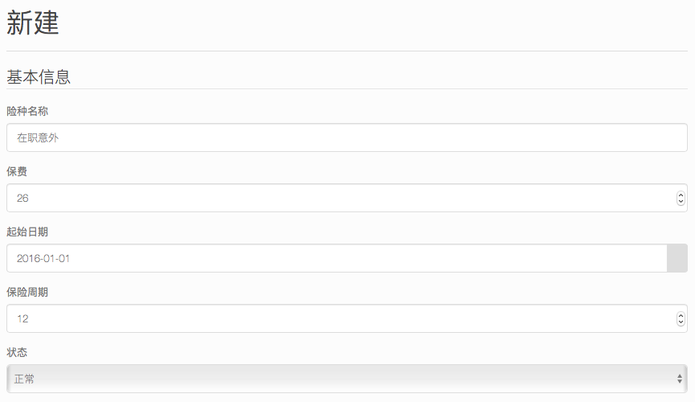

# 三步搞定会员保险
又到了给教职工续保的时候，不同险种，不同续保周期让续保工作复杂度大增。办公室工作繁忙，人来人往，很难安安静静地测算保险费用。

工会宝“保险家”功能，帮您三步搞定保险投保、续保功能。

## 第一步：设置险种
为了生成保单，首先需要设置要投保的险种（这样系统才知道您要投保哪些保险呀）

一般来说学校会上五种保险：

* 女工特疾：每两年续保一次，保费40元
* 重大疾病：每三年续保一次，保费90元
* 住院医疗：每年续保一次，保费56元
* 住院津贴：每年续保一次，保费60元
* 在职意外：每年续保一次，保费26元

具体操作如下：

在“工会宝”页面顶部导航栏中点击“保险”，在下拉菜单中选择“险种管理”，并在出现的页面中点击“新建”按钮。

为新的保险种类填入基本信息，保险周期为月份数，如周期为一年的就填12

在基本信息的下方是投保规则，在这里可以选择该险种的投保规则，如“女工特疾”就在“性别限制”一栏内只选择“女”

设置好基本信息和投保规则后点击“新增保险种类”就行。

## 第二步：导入历史投保记录
现在进入到关键的第二步，导入历史投保信息，系统就是根据以往的投保信息，自动推算下一年度投保记录。（提示：导入历史记录之前要先初始化会员信息）

在“保险”菜单中选择“投保记录”，在打开的“投保记录”页面最下方，点击“导入历史记录”按钮，就进入了记录上传界面。

按页面提示填写记录文件有关的险种信息，请仔细核对，不要填错，包括险种、生效时间、保险周期，然后在数据文件一栏选择该年份提交给保险公司的清单，点击导入就能将原有信息导入系统了。

需要注意的是，每个险种需要导入一个周期的投保记录，以保证推算结果的正确。如重大疾病保期为三年，则需要导入以往三个年份的数据。

导入成功的保险信息能“投保记录”中能够查询到，如有出错，在“数据文件”中能够查看具体的错误信息。

## 第三步：批量投保
在险种设置完成后，回到“保险种类”界面（仍然是在导航栏中选择“保险”--“险种管理”）

点击险种表格中每行最后一个按钮“批量投保”，即可看到批量投保信息和自动根据之前设置的投保规则过滤出的参保人员信息，在这里还可以选择该保险的“起始日期”

确认无误后，点击“生成保单”按钮，稍候片该，系统就已自动生成了保险记录，之后将保险记录批量导出就可以了。

点击页面下方的“导出投保信息”，弹出导出操作窗口，选择险种和批量投保时选择的起始日期，再点“导出”就能生成所有该险种信息的excel格式文件了。

数据文件会单独存放，方便多次下载使用。

把数据文件下载下来，再上传到保险平台就完成续保工作了。

如有操作问题，请联系QQ: 66612092 中国戏曲学院 冯路老师